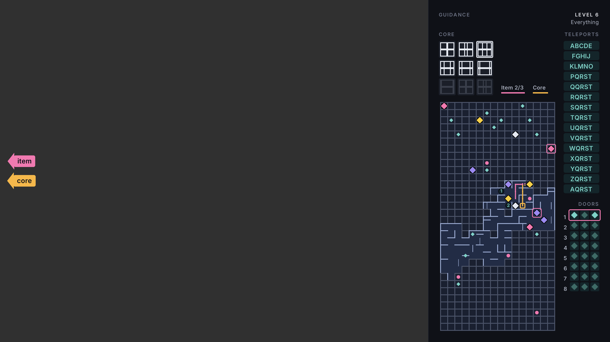

# Starquake in Rust

A from-scratch reimplementation of **Starquake** (Stephen Crow, Bubble Bus
Software, 1985) for modern systems, written in Rust. It is not an emulator. The game logic is
rewritten as ordinary Rust, and the original is only used as a reference while
developing.

## You need the original game

This repository contains **no code or data from the original game**. The
game loads every graphic, map and piece of text at startup from your own
copy of Starquake (a `.tap` tape; see [assets/README.md](assets/README.md)),
and will not run without it. A tape also carries the loading screen, which
is shown before the title screen.

[World of Spectrum](https://worldofspectrum.net/) keeps Spectrum software
available and removes titles whose rights holders object, and it lists
Starquake as available. That is not the rights holders' permission, which
nobody here has seen. A dump of your own tape works equally well. See
[assets/README.md](assets/README.md) for that and for where the development
tools' ZX Spectrum ROM can legitimately be had.

## Playing

```sh
cargo run --release -p starquake -- assets/starquake.tap
```

Where to put the tape, the controls, and everything else a player needs are
in [docs/player/README.txt](docs/player/README.txt). That folder is what a
release archive carries besides the program.

### Guidance

Beside the picture is a panel for optional help, drawn by the program and
never by the game, so nothing in it can change what the game does (#1). Esc,
or Select on a gamepad, opens a menu that pauses the game and sets a guidance
level from 0 (the original) to 6, and training mode. The highest level used,
and whether training mode was on, are shown beside the game-over and
high-score screens. The levels are ZX Sidekick's re-cut (#91), each adding
to the ones below it:



*Level 6, every guide on: the codes, the core, the whole map with its
items, and routes to a piece and to the core, with arrows at the picture's
edge for the way out. Drawn by the panel's render test, so the picture is a
grey stand-in, the map and codes are made up, and the items and the core's
pieces are drawn shapes: the game's own pictures stay out of the repository.*

| level | | adds |
|:-:|---|---|
| 1 | Codes and the core | the codes of the teleports entered (#50) and each security door's key code cards once shown (#94), in a rail at the right, and the core's nine slots in the game's own pictures at the top left |
| 2 | The map you have walked | a map of the rooms visited, with their openings (#2) |
| 3 | What you have seen | the items lying in rooms walked through, in the game's own pictures, coloured by what they do (#93) |
| 4 | What you have not | the same in rooms not reached |
| 5 | Routes | routes to a piece and to the core (#52) |
| 6 | Everything | every code and the whole planet (#95) |

Levels 0 to 3 show only what you could have written down yourself; 4 and up
tell you things you could not have known. Training mode (#4) is five
switches in the same menu: full energy, full bridging platforms, full laser,
endless lives and no harm from enemies, each obeyed by the game where it
decides that thing, and named on the game's score.

## Status

The whole game is here: the title screen and its menu, the intro, play,
security doors, teleport booths and the Cheops pyramid, losing a life,
delivering pieces to the planet's core, the ending, the game-over screen and
the high-score table, with the original's sound and music.

Verified against the original, byte for byte, by running the same situations
through both. The interpreter that runs the original is itself checked against
an independent description of the processor (see *Verification*). What is
covered:

- Room building (all 512 rooms), the status panel and its text printing,
  pickups, entering rooms, enemy spawning.
- Every frame of play: sprites, their colours, platforms, sparkles, force
  fields, enemy behaviour, BLOB's movement, shooting, lifts, hover platform,
  pickups and inventory, hazards, room exits, and the sound state.
- New-game setup for every control method, and the menu screens.
- Losing a life, the game-over screen, security doors, and the core room.
- The music: every tune matches the original's timing to the T-state, which
  sets the pitch, the buzz and the tempo.
- The sound effects and the tone under them, to the T-state wherever in the
  frame they play: the ULA holds them up while it draws the picture, so the
  same effect is lower in the middle of the screen than in the border.

Rewritten but not checked against the original on their own: the intro and
high-score screens, teleport booths, the Cheops pyramid, and the ending
screen. They are built out of the drawing, printing and scoring code the
checks above do cover.

Three things cannot match exactly: anything derived from how
long the player took (the frame counter seeds a room's random numbers, and
the time is shown at the end), screens whose loops run faster than 50 Hz
in the original, which here take one step per frame, and the length of the
silence at the start of each frame of play. The original is quiet while it
does the frame's work and plays the tone after, so the gap is however long
the work took; the rewrite does the same work without a clock and estimates
it from what the frame did (collision tests, printing, cells drawn, enemies
checked). In nine frames out of ten the tone starts within 0.8 ms of the
original's.

## Layout

| Path | What |
|------|------|
| `games/starquake` | The game (library) and the playable program (`frontend` feature: pixels, winit, cpal). |
| `tools/sq-verify` | Differential tests against the original (development only). |
| `crates/zx-runtime` | Reference ZX Spectrum/Z80 interpreter that runs the original for comparison (development only; not part of the game). |
| `crates/zx-core` | Z80 decoder, `.tap` loader, PNG writer. |
| `crates/zx-recomp` | Tracing and disassembly-listing tool used for reverse engineering (development only). |
| `docs/re` | Reverse-engineering notes. |
| `docs/player` | The guide for players: where to put the tape, and the controls. A release archive carries this folder. |
| `games/starquake/fonts` | Inter, the font the program draws its own screens in (such as the one asking for the tape), unmodified, with its licence. |

## Verification

With `starquake.tap` and `48.rom` in `assets/`:

```sh
cargo run --release -p sq-verify
```

Each check runs a routine of the original in the reference interpreter and
the rewritten code from the same starting state (thousands of states, from
real play and from a tour of the map), then compares the resulting screen
and game state byte for byte.

The long runs (starquake-recompiled#120) go further: the original plays
from its menu under random held input, taken to a random room every few
seconds, and at every frame of play the rewrite runs one frame from the
original's state and the two are compared. The frame BLOB leaves a room in
is the exception, since the new room's random numbers are seeded from the
frame counter (see *Status*; starquake-recompiled#136). The gate plays three
runs of 20,000 frames; `cargo run --release -p sq-verify -- long 100000`
plays three of 100,000 (about 190,000 frames compared in some 440 rooms,
in under a minute and a half).

One check is different, because what it checks is not in the original: *map
openings* plays the rewrite on from the same states under random joystick
input and checks that every edge BLOB leaves a room through is one the
guidance map (#2) shows open.

### What the reference interpreter rests on

Those checks only prove the rewrite matches our interpreter, and the rewrite
was written by checking against that interpreter. An interpreter that got an
opcode wrong would have had the mistake copied into the rewrite, and every
check above would still pass.

The interpreter is therefore checked as well, against the
[Fuse](https://fuse-emulator.sourceforge.net/) project's Z80 test corpus. It
states for 1335 cases what the registers, memory and T-state count should be
afterwards, undocumented behaviour included.

```sh
cargo test -p zx-runtime --test fuse -- --nocapture
```

It found three faults, none of which Starquake depended on:
`BIT n,(IX+d)` took flag bits 3 and 5 from the byte tested instead of from
the high byte of the address, `HALT` left PC past the instruction instead of
on it, and writes below 0x4000 were dropped even with no ROM loaded. All
1335 cases pass now.

The corpus does not check bus timing cycle by cycle: the contention pattern
the ULA imposes while drawing the picture, which holds the processor off the
bottom 16K of RAM. That is modelled as well, from the machine cycles each
instruction makes, and checked against the corpus's own record of when each
instruction touches the bus.

Contention changes real behaviour. The menu paces itself by how fast it can
redraw, and that loop lives in the contended sixteen kilobytes. Measured on a
machine that never stalls it managed 13 turns a second; on a real one, 12, so
the highlight had been flashing about 8% fast. The tape's loader puts the stack
there too (`CLEAR 24103`), so the music player waits on the picture six times
in every half-cycle.

The checks read the tape and `48.rom`, the ROM needed only for development:
the reference interpreter needs a running machine to compare against. The
original starts from the tape where the ROM's loader returns into it
(`layout::ENTRY_PC`), runs its own start-up and title tune on the real ROM,
and every check starts from its menu. Until starquake-recompiled#117 the
checks ran a `.z80` snapshot instead, which differed from the tape in one byte
of code (`D91A`, a damaged `JR NZ`); the rewrite had copied it and the checks,
running the same bytes, agreed. Nothing reads a snapshot now.

`starquake --headless FRAMES DIR` plays with random input and writes
screenshots, for testing without a window.

`starquake --bench SECONDS` plays with its real sound and pacing but no
window, and reports how long frames actually took. The game is paced by the
clock at the Spectrum's own frame rate (19.968ms), so a median away from that
means the pacing is wrong, not that the game is slow.

## How this was built

@starquake started this project, said what it should be, and steered it
throughout. Claude, Anthropic's AI assistant, wrote it: about 14,000 lines of
Rust over three sessions, and every commit in this repository.

It began as an attempt to translate a Spectrum game into Rust at compile time
rather than emulate it. That is static recompilation, and `crates/zx-recomp`
is named after it. The attempt was dropped when @starquake decided the game
should need no Z80 runtime at all, a choice made knowing that a hand rewrite
was several times more work. `zx-recomp` now traces and disassembles the
original, and the rewrite was written from its listings.

@starquake supplied the game and the ROM, set the rule that nothing from
either may be embedded in the binary, chose the direction at each fork,
corrected the work, and holds the only merge authority here. Claude wrote the
code, the notes in `docs/re`, the tests and the documentation.

Reference material: the original program, disassembled by `zx-recomp`; the
Z80 instruction set, including the undocumented flag behaviour; the
[`.z80` format reference](https://worldofspectrum.org/faq/reference/z80format.htm);
the [Fuse](https://fuse-emulator.sourceforge.net/) project's Z80 test corpus,
which found three faults in the reference interpreter; and
[World of Spectrum](https://worldofspectrum.net/) for the game and the ROM.

## Legal

Starquake is copyright © 1985 Stephen Crow / Bubble Bus Software. This project
is an independent reimplementation and is **not affiliated with, endorsed by,
or approved by** the rights holders.

It contains **no code, graphics, maps, text or sound from the original game**.
All of that is read at startup from a copy of the original that you supply
yourself, and the program will not run without one. The reverse-engineering
notes in `docs/re` are descriptions in our own words; no disassembly of the
original is reproduced here.

The Rust code in this repository is licensed under either [MIT](LICENSE-MIT)
or [Apache 2.0](LICENSE-APACHE), at your option. Two licence files means you
choose one, not that both bind you. That is the Rust ecosystem's convention:
Apache 2.0 carries an explicit patent grant, and MIT stays compatible with
GPLv2. The licence covers only this reimplementation and grants no rights in
Starquake itself.

The program links other people's code into its binary, and
[THIRD-PARTY.md](THIRD-PARTY.md) carries the licences that requires. It is
generated by `cargo about` and committed to the repository, and CI fails if it
goes stale. The program's own screens are set in
[Inter](https://github.com/rsms/inter), under the SIL Open Font License
([games/starquake/fonts/LICENSE.txt](games/starquake/fonts/LICENSE.txt)); a
release archive carries that licence as `LICENSE-Inter.txt`.
